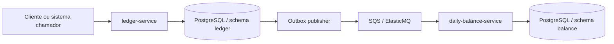

# Desafio Verx - Fluxo de Caixa Diário

Este repositório apresenta uma solução para registro de lançamentos financeiros e consolidação de saldo diário por comerciante. A implementação foi feita em **TypeScript + NestJS**, com **Clean Architecture**, comunicação assíncrona por eventos e uma leitura otimizada por projeção materializada.

O foco do case não é apenas mostrar que a API funciona. O objetivo é deixar explícito o raciocínio de arquitetura:

- por que a escrita foi separada da leitura;
- por que a integração é assíncrona;
- por que a consistência eventual foi aceita;
- quais gaps ainda existem;
- como a solução pode evoluir sem perder a base atual.

## Visão executiva

A solução foi organizada em dois contextos:

- **Ledger**: recebe créditos e débitos, garante idempotência por `requestId`, grava a outbox e preserva a integridade da escrita.
- **Daily Balance**: consome eventos `entry-created`, consolida o saldo diário e expõe a consulta agregada.

Essa separação foi escolhida para manter:

- a escrita transacional simples e confiável;
- a leitura rápida e barata;
- a integração desacoplada por eventos;
- a evolução futura da arquitetura mais natural.

## Diagrama de alto nível



## Documentação detalhada

Os Markdown abaixo passam a ser a fonte textual de verdade da solução:

- [01-visao-geral.md](/Users/thiagoferraz/Documents/pessoal/desafio-verx/docs/01-visao-geral.md)
- [02-dominios-e-capacidades.md](/Users/thiagoferraz/Documents/pessoal/desafio-verx/docs/02-dominios-e-capacidades.md)
- [03-arquitetura-e-integracoes.md](/Users/thiagoferraz/Documents/pessoal/desafio-verx/docs/03-arquitetura-e-integracoes.md)
- [04-decisoes-tecnicas-e-nfrs.md](/Users/thiagoferraz/Documents/pessoal/desafio-verx/docs/04-decisoes-tecnicas-e-nfrs.md)
- [05-testes-e-validacao.md](/Users/thiagoferraz/Documents/pessoal/desafio-verx/docs/05-testes-e-validacao.md)
- [06-evolucao-da-arquitetura.md](/Users/thiagoferraz/Documents/pessoal/desafio-verx/docs/06-evolucao-da-arquitetura.md)

Diagramas fonte:

- [solution-overview.svg](/Users/thiagoferraz/Documents/pessoal/desafio-verx/docs/diagrams/solution-overview.svg) - C4 nível 1, contexto do sistema
- [architecture-c4.svg](/Users/thiagoferraz/Documents/pessoal/desafio-verx/docs/diagrams/architecture-c4.svg) - C4 nível 2, containers
- [transition-architecture.svg](/Users/thiagoferraz/Documents/pessoal/desafio-verx/docs/diagrams/transition-architecture.svg)
- [transition-architecture.html](/Users/thiagoferraz/Documents/pessoal/desafio-verx/docs/diagrams/transition-architecture.html)

PDFs gerados a partir dessa base:

- [docs/pdf](/Users/thiagoferraz/Documents/pessoal/desafio-verx/docs/pdf)

## O que a solução entrega hoje

- `POST /entries`
- `GET /entries?merchantId=...`
- `GET /daily-balance?merchantId=...&date=YYYY-MM-DD`
- `GET /health`
- evento de integração `entry-created`
- idempotência na entrada HTTP
- idempotência no consumo assíncrono
- publicação de eventos via Transactional Outbox

## O que a validação mostrou

Nesta revisão, os seguintes comandos foram executados com sucesso:

```bash
npm install
npm run build
npm test
npm run test:e2e
```

Também foi identificado e corrigido um gap operacional no ambiente local:

- a imagem `softwaremill/elasticmq-native:1.5.10` não estava mais disponível;
- o `docker-compose.yml` foi atualizado para `softwaremill/elasticmq-native`.

Os gaps arquiteturais abertos continuam documentados de forma explícita, em vez de serem escondidos.

## Principais gaps assumidos

- concorrência do publisher da outbox ainda é simples;
- política de retry e DLQ ainda não existe;
- observabilidade ainda é básica;
- banco ainda é compartilhado entre contextos;
- a leitura é eventualmente consistente, e não imediata.

Esses pontos aparecem nos docs como:

- limitação atual;
- trade-off assumido;
- evolução futura recomendada.

## Como executar

### Pré-requisitos

- Node.js 20+
- Docker
- Docker Compose

### Infraestrutura local

```bash
docker compose up -d
```

### Instalação e build

```bash
npm install
npm run build
```

### Execução em desenvolvimento

Em um terminal:

```bash
npm run dev:ledger
```

Em outro terminal:

```bash
npm run dev:daily-balance
```

### Testes

```bash
npm test
npm run test:e2e
```

Informações sobre teste de carga:

```bash
npm run test:load:info
```

## Variáveis de ambiente

| Variável | Descrição | Padrão |
|---|---|---|
| `DB_HOST` | Host do PostgreSQL | `localhost` |
| `DB_PORT` | Porta do PostgreSQL | `5432` |
| `DB_NAME` | Nome do banco | `cashflow` |
| `DB_USER` | Usuário do banco | `cashflow` |
| `DB_PASSWORD` | Senha do banco | `cashflow` |
| `LEDGER_PORT` | Porta do `ledger-service` | `3000` |
| `DAILY_BALANCE_PORT` | Porta do `daily-balance-service` | `3001` |
| `API_KEY` | Chave opcional para `x-api-key` | vazio |
| `SQS_QUEUE_URL` | URL da fila | `http://localhost:9324/000000000000/entry-created` |
| `SQS_REGION` | Região AWS SDK | `us-east-1` |
| `SQS_ENDPOINT` | Endpoint do ElasticMQ | `http://localhost:9324` |
| `AWS_ACCESS_KEY_ID` | Credencial local do SDK | `test` |
| `AWS_SECRET_ACCESS_KEY` | Credencial local do SDK | `test` |
| `OUTBOX_PUBLISH_INTERVAL_MS` | Intervalo do publisher | `2000` |
| `SQS_POLL_INTERVAL_MS` | Intervalo do poller | `2000` |

## Conclusão arquitetural

Para o escopo do desafio, a solução entrega uma base arquitetural sólida:

- separa bem os domínios;
- usa outbox e idempotência de forma coerente;
- torna a consistência eventual uma decisão consciente;
- fornece uma leitura otimizada por projeção materializada;
- preserva um caminho claro de evolução futura.

Ao mesmo tempo, os limites atuais ficam explicitados no próprio material, o que torna a entrega mais honesta, profissional e defensável do ponto de vista de arquitetura de soluções.
