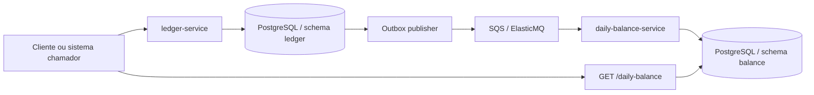

# Arquitetura e Integrações

## Arquitetura da solução

A solução adota uma arquitetura com dois serviços por contexto de negócio, integrados de forma assíncrona:

- `ledger-service`: entrada transacional de lançamentos;
- `daily-balance-service`: consolidação e consulta do saldo diário;
- PostgreSQL: persistência local dos dois contextos, com separação lógica por schema;
- SQS/ElasticMQ: canal assíncrono de integração;
- outbox publisher: mecanismo de publicação dos eventos pendentes.

## Diagrama de alto nível

## Estado atual versus evolução futura

### Estado atual

- dois serviços HTTP;
- um único PostgreSQL com dois schemas;
- fila local ElasticMQ para desenvolvimento;
- polling simples para publicação e consumo;
- consistência eventual entre ledger e saldo diário.

### Evolução futura

- separação física de bancos por contexto;
- mecanismos mais robustos de retry e DLQ;
- observabilidade madura;
- escala independente por workload;
- pipelines formais de governança e monitoramento.

## Visão C4 existente no repositório

Os diagramas fonte mantidos em `docs/diagrams/` complementam esta visão:

- [solution-overview.svg](/Users/thiagoferraz/Documents/pessoal/desafio-verx/docs/diagrams/solution-overview.svg): C4 nível 1, contexto do sistema
- [architecture-c4.svg](/Users/thiagoferraz/Documents/pessoal/desafio-verx/docs/diagrams/architecture-c4.svg): C4 nível 2, containers
- [transition-architecture.svg](/Users/thiagoferraz/Documents/pessoal/desafio-verx/docs/diagrams/transition-architecture.svg)
- [transition-architecture.html](/Users/thiagoferraz/Documents/pessoal/desafio-verx/docs/diagrams/transition-architecture.html)

## Modelo de integração

### Contrato do evento `entry-created`

O contrato compartilhado está em [entry-created.event.ts](/Users/thiagoferraz/Documents/pessoal/desafio-verx/libs/contracts/entry-created.event.ts).

Campos:

| Campo | Papel |
|---|---|
| `eventId` | identificador do evento e marcador da mudança aplicada |
| `entryId` | identificador do lançamento original |
| `merchantId` | comerciante dono do movimento |
| `type` | `CREDIT` ou `DEBIT` |
| `amountCents` | valor monetário em centavos |
| `description` | descrição opcional do evento |
| `occurredAt` | data/hora efetiva do lançamento |
| `createdAt` | data/hora de criação do registro no ledger |

### Por que esse contrato existe

Ele desacopla produtor e consumidor por um fato de negócio claro: "um lançamento foi criado".

Isso permite:

- manter o `daily-balance-service` independente da API interna do ledger;
- tornar possível adicionar novos consumidores no futuro;
- estabilizar a integração em torno de um contrato sem dependências diretas de banco.

### Como os serviços se comunicam

1. O `ledger-service` registra o lançamento e um evento pendente na outbox.
2. O publisher periódico busca eventos com status `PENDING`.
3. Cada evento é publicado na fila `entry-created`.
4. O `daily-balance-service` faz polling da fila.
5. Ao receber a mensagem, o evento é convertido e processado.
6. O saldo diário é atualizado na projeção.
7. A mensagem é removida da fila apenas após sucesso.

### Semântica de entrega

A integração foi desenhada assumindo semântica **at-least-once**:

- uma mensagem pode ser entregue mais de uma vez;
- o consumidor precisa ser idempotente;
- o saldo não deve depender de entrega exatamente uma vez.

Essa escolha é coerente com SQS/ElasticMQ e evita depender de garantias mais caras ou mais complexas de operar.

## Fluxo ponta a ponta da solução

### Fluxo 1: criação do lançamento

1. O cliente envia `POST /entries`.
2. O `ledger-service` valida o payload.
3. O caso de uso consulta o repositório de idempotência por `requestId`.
4. Se a requisição já foi processada, o mesmo lançamento é retornado.
5. Se for nova, o sistema cria a entidade `Entry`.
6. O sistema monta o evento `entry-created`.
7. Em uma única transação, persiste:
   - `ledger.entries`
   - `ledger.request_idempotency`
   - `ledger.outbox_events`

### Fluxo 2: publicação da outbox

1. O `OutboxPublisherService` roda em intervalo fixo.
2. Busca até 20 eventos `PENDING`.
3. Publica cada evento para a fila.
4. Se a publicação der certo, marca o evento como `PUBLISHED`.

### Fluxo 3: consolidação do saldo diário

1. O `SqsPollerService` busca mensagens na fila.
2. Para cada mensagem válida:
   - converte o corpo em `EntryCreatedEvent`;
   - executa o caso de uso de consolidação.
3. O caso de uso verifica se `messageId` já foi processado.
4. Se não foi:
   - identifica o dia do saldo a partir de `occurredAt`;
   - carrega ou inicializa a projeção;
   - aplica crédito ou débito;
   - persiste a projeção atualizada;
   - grava o `messageId` em `processed_messages`.
5. Após sucesso, a mensagem é removida da fila.

### Fluxo 4: consulta do saldo

1. O cliente chama `GET /daily-balance?merchantId=...&date=YYYY-MM-DD`.
2. O `daily-balance-service` consulta `balance.daily_balances`.
3. Se encontrar, retorna totais e saldo do dia.
4. Se não encontrar, responde `404`.

## Pontos de integração e seus riscos

| Ponto | Benefício | Risco atual |
|---|---|---|
| Outbox | evita perder evento entre banco e fila | pode haver duplicidade de publicação em concorrência |
| Fila SQS/ElasticMQ | desacopla escrita e leitura | entrega pode ser repetida |
| Processed messages | protege a projeção contra duplicidade | a estratégia concorrente ainda é simples |
| Projeção de leitura | consulta rápida e barata | saldo pode atrasar em relação ao ledger |

## Pontos fortes da arquitetura atual

- fronteiras de domínio bem explícitas;
- escrita transacional desacoplada da leitura agregada;
- contrato de integração claro;
- uso consciente de consistência eventual;
- idempotência aplicada nas duas bordas mais sensíveis.

## Gaps assumidos na arquitetura atual

- publicação concorrente da outbox;
- ausência de DLQ e retry formal;
- falta de tratamento mais explícito para corrida concorrente no consumidor;
- operação local dependente de uma imagem Docker que precisou ser atualizada.
